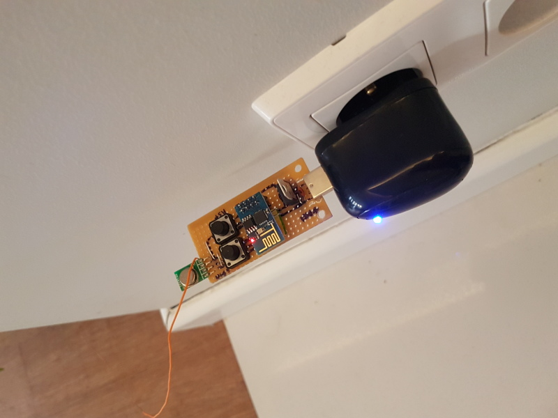

TBD

# Assembly
Done circuit on stripboard. 

# Parts:

* ESP8266-01 - wifi module and micro controller
* LF33CV - 3.3 voltage regulator
* USB typa A plug - for PCB
* [WRL-10534](https://www.sparkfun.com/products/10534) - 433 rc transmitter
* strip board
